# Proyek UAS Pemrograman Web Lanjut (PWL) - Starter Kit

## Deskripsi Proyek

Proyek ini merupakan implementasi **aplikasi starter kit** yang dikembangkan menggunakan **framework Laravel 10.x ke atas** dan CodeIgniter (jika juga diimplementasikan dalam repositori ini, tambahkan detailnya). Tujuan utama dari starter kit ini adalah untuk menyediakan fondasi yang kokoh dan siap pakai untuk pengembangan proyek web baru, dilengkapi dengan fitur-fitur esensial untuk manajemen pengguna, autentikasi, serta sistem manajemen konten dasar.

**Fitur Utama Starter Kit:**

1.  **Framework:** Laravel 10.x+
2.  **Integrasi Template:** Menggunakan template admin **AdminLTE / SB Admin / SB Admin 2** (sesuaikan dengan yang Anda pakai) untuk antarmuka yang modern dan responsif.
3.  **Sistem Autentikasi Komprehensif:**
    * Sign In (Login)
    * Registrasi Pengguna Baru
    * Reset Password
    * Fitur "Remember Me"
    * Edit Profil User
4.  **Manajemen Pengguna dengan Level Akses (Role-Based Access Control):**
    * Admin
    * Editor
    * Wartawan
5.  **Manajemen Berita (CRUD - Create, Read, Update, Delete):**
    * Unggah gambar untuk setiap berita.
    * Kategori berita diambil dari tabel kategori terpisah.
    * Pengirim berita otomatis disesuaikan dengan user yang login (khusus role Wartawan).
    * Status berita awal adalah "Draft" setelah dibuat.
6.  **Fitur Approval Berita:**
    * Berita dengan status "Draft" dapat disetujui (publish) atau ditolak oleh user dengan level akses "Editor".
7.  **Fitur Optional (Jika Diimplementasikan):**
    * Login menggunakan akun eksternal seperti GitHub, Google, atau Microsoft.

## Instalasi dan Setup

Ikuti langkah-langkah di bawah ini untuk menjalankan proyek secara lokal:

1.  **Kloning Repositori:**
    ```bash
    git clone [https://github.com/abikhoir/uas_pwl_starter-kit.git](https://github.com/abikhoir/uas_pwl_starter-kit.git)
    cd uas_pwl_starter-kit
    ```
2.  **Instal Dependensi Composer:**
    ```bash
    composer install
    ```
3.  **Salin File Lingkungan:**
    ```bash
    cp .env.example .env
    ```
4.  **Konfigurasi `.env`:**
    Buka file `.env` dan sesuaikan pengaturan database Anda:
    ```env
    DB_CONNECTION=mysql
    DB_HOST=127.0.0.1
    DB_PORT=3306
    DB_DATABASE=pwl_uas_db # Ganti dengan nama database yang Anda inginkan
    DB_USERNAME=root      # Ganti dengan username database Anda
    DB_PASSWORD=          # Ganti dengan password database Anda (kosongkan jika tidak ada)
    ```
5.  **Buat Database:**
    Buat database baru di phpMyAdmin atau tool manajemen database lainnya dengan nama yang sesuai dengan `DB_DATABASE` di `.env` Anda (contoh: `pwl_uas_db`).
6.  **Jalankan Migrasi Database dan Seeder:**
    ```bash
    php artisan migrate --seed
    ```
    *(Perintah ini akan membuat tabel-tabel database dan mengisi data awal, termasuk user dengan role yang berbeda, jika seeder telah dikonfigurasi.)*
7.  **Buat Kunci Aplikasi:**
    ```bash
    php artisan key:generate
    ```
8.  **Buat Symlink untuk Storage (untuk gambar):**
    ```bash
    php artisan storage:link
    ```
9.  **Jalankan Server Lokal:**
    ```bash
    php artisan serve
    ```
    Aplikasi akan berjalan di `http://127.0.0.1:8000` (atau port lain yang ditunjukkan).

## Demo Aplikasi (Tangkapan Layar)

Berikut adalah beberapa tangkapan layar untuk mendemonstrasikan fungsionalitas dan fitur aplikasi:

### **1. Halaman Selamat Datang / Landing Page**
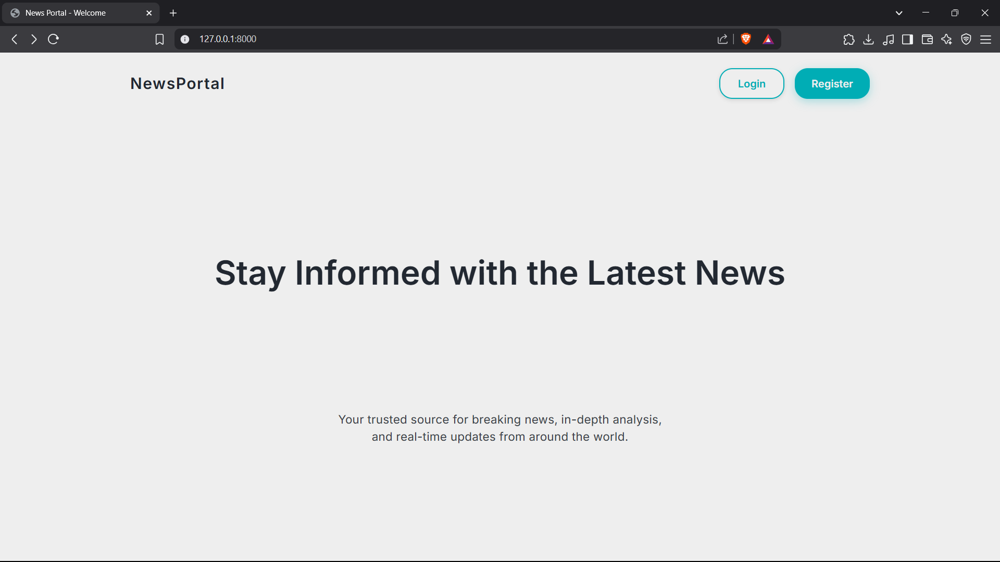

### **2. Autentikasi Pengguna**
* **Halaman Login:**
    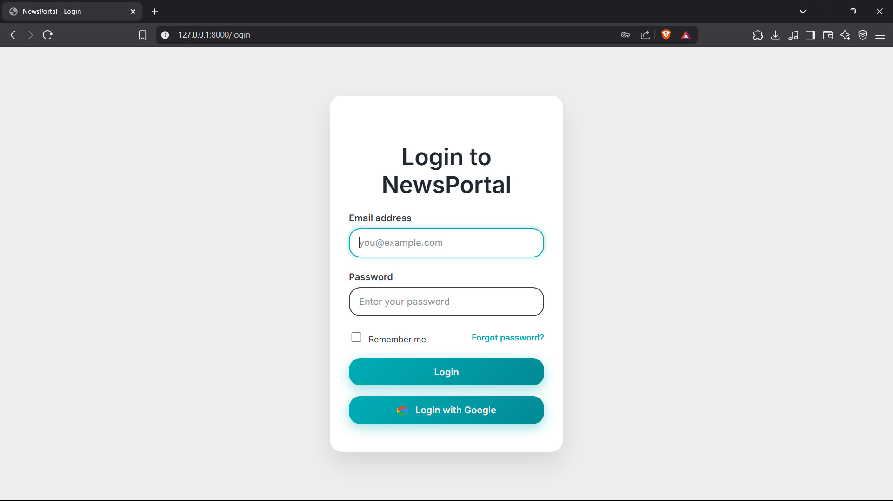
* **Halaman Registrasi:**
    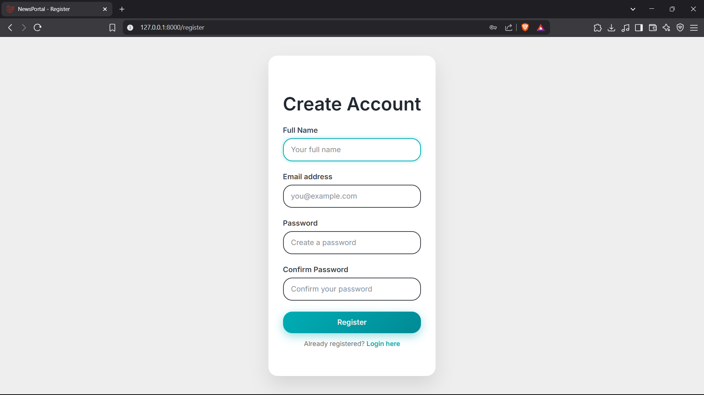
* **Halaman Lupa Password:**
    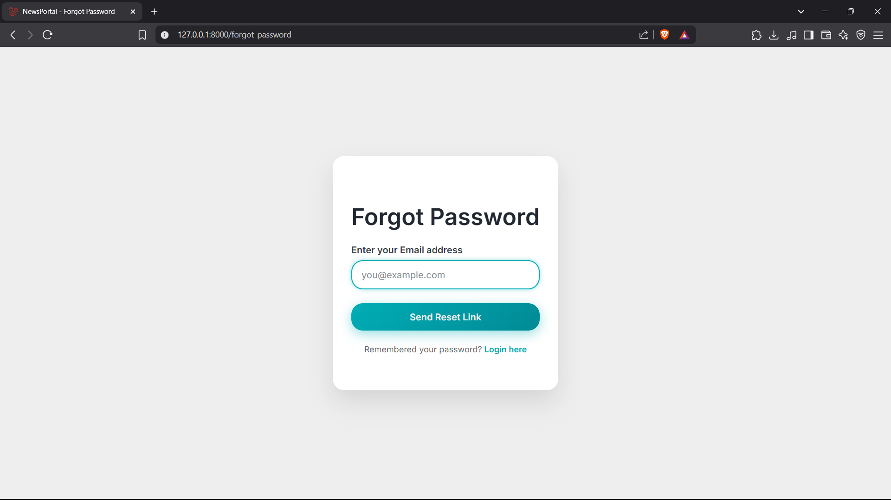
* **Login dengan Google (Fitur Optional):**
    *(Hanya jika diimplementasikan)*
    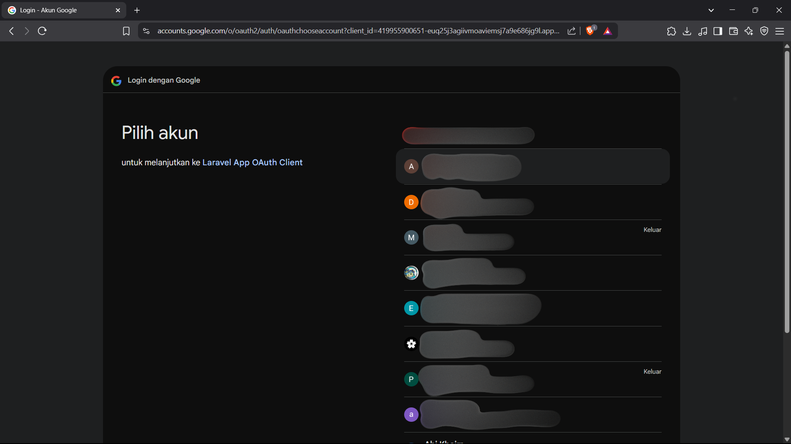

### **3. Dashboard Berdasarkan Role**
* **Dashboard Admin:**
    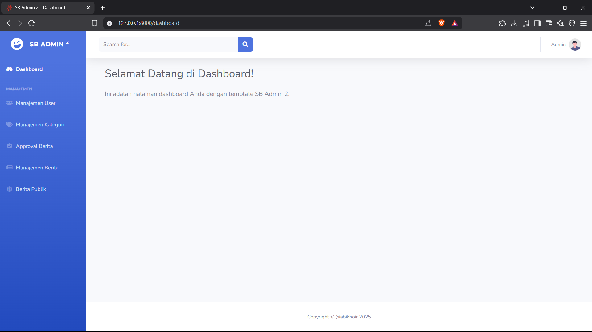
* **Dashboard Editor:**
    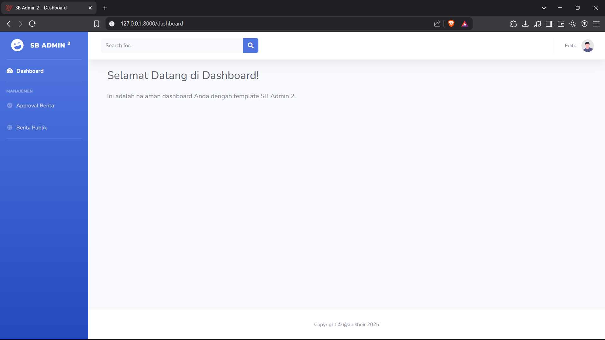
* **Dashboard Wartawan:**
    

### **4. Manajemen Pengguna**
* **Halaman Manajemen User:**
    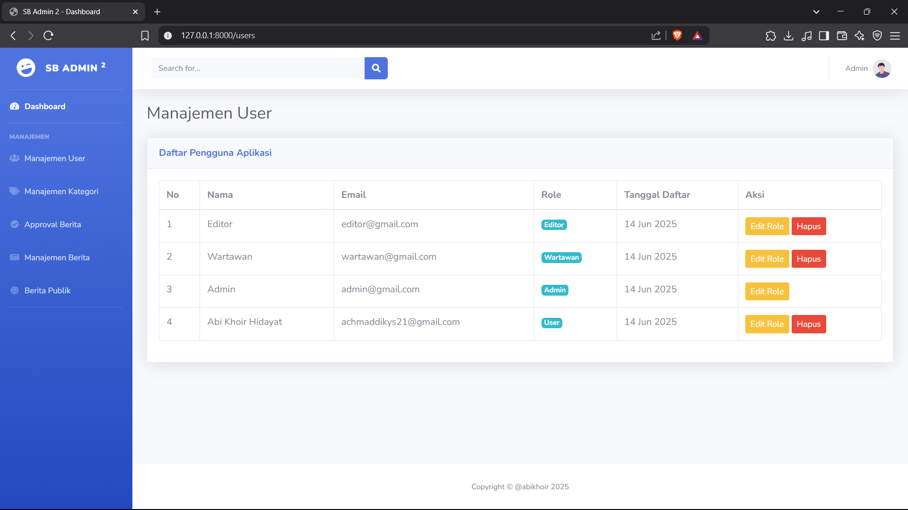

### **5. Manajemen Kategori Berita**
* **Halaman Manajemen Kategori:**
    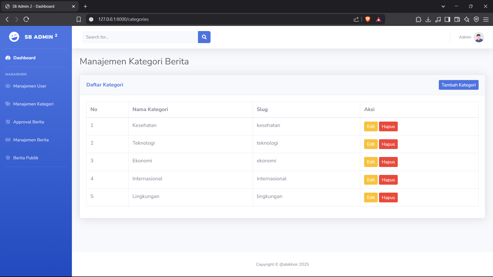
* **Pilihan Kategori saat Membuat Berita:**
    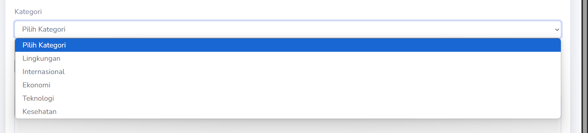

### **6. Manajemen Berita (CRUD)**
* **Halaman Manajemen Berita (Admin/Wartawan):**
    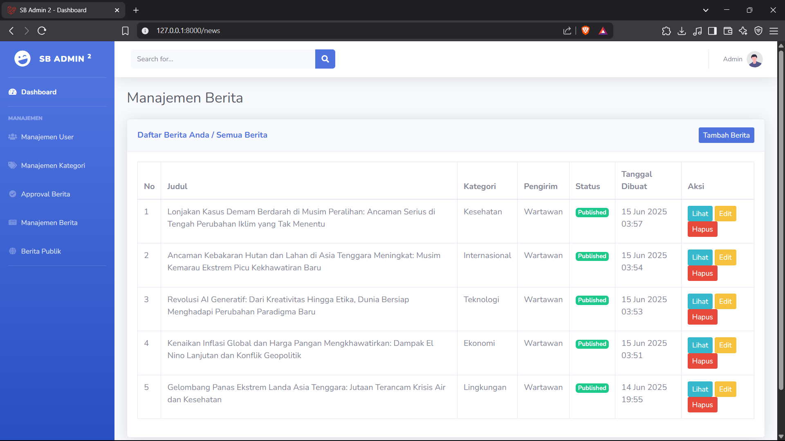
* **Halaman Tambah Berita (dengan Unggah Gambar):**
    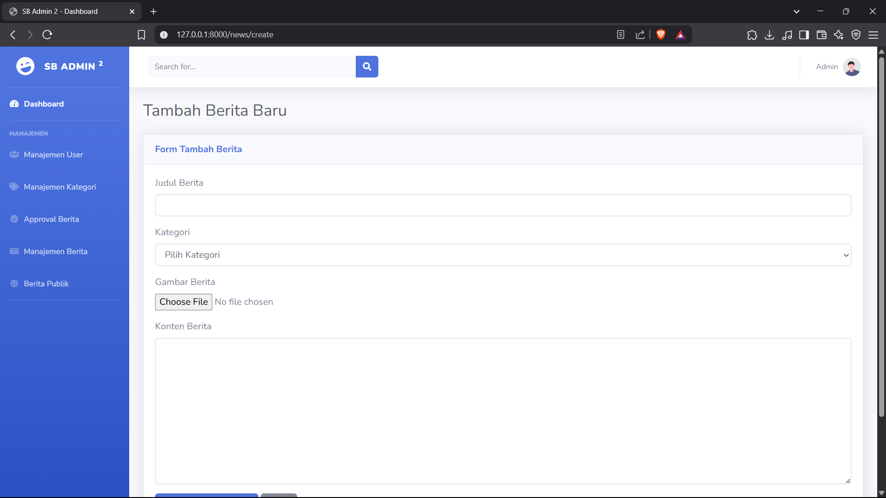
    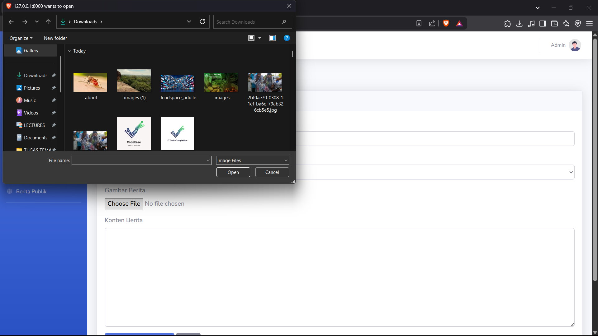
* **Halaman Berita Publik (Setelah Dipublish):**
    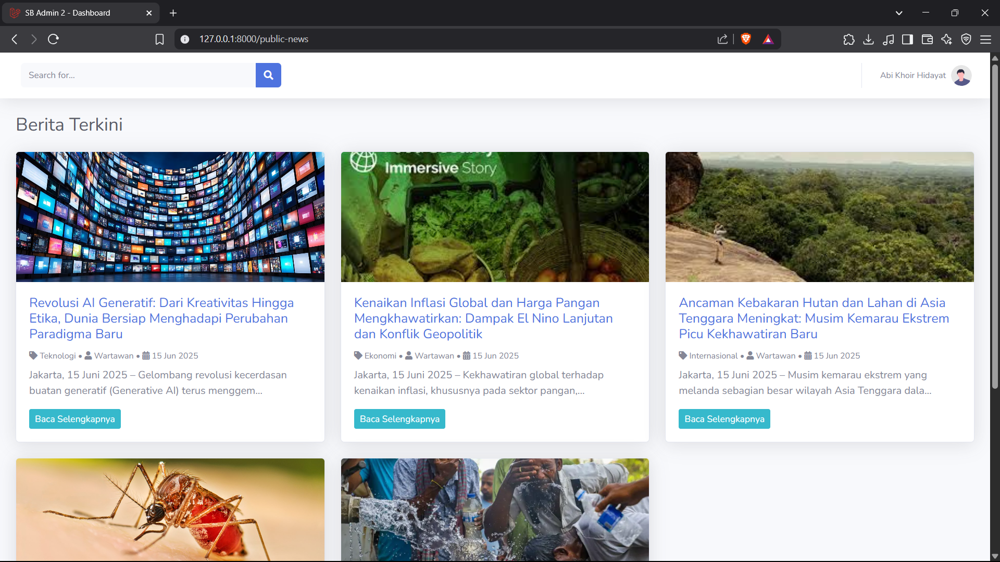

### **7. Fitur Approval Berita (Role Editor)**
* **Halaman Approval Berita (khusus Editor):**
    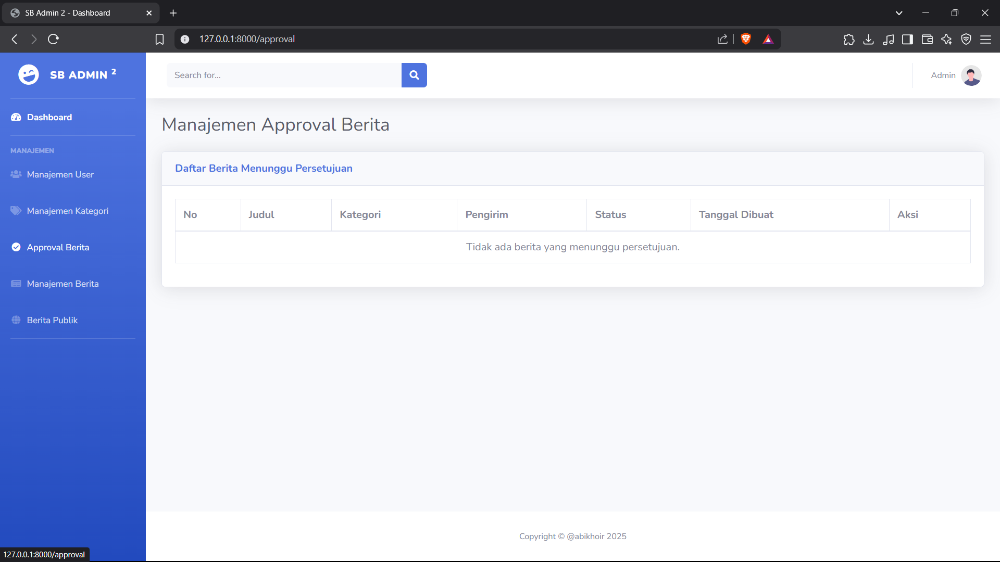

---

## Informasi Proyek

* **Nama Mahasiswa:** Abi Khoir Hidayat
* **NIM:** 23091397205
* **Kelas:** 2023 F
* **Mata Kuliah:** Pemrograman Web Lanjut (UAS)

---